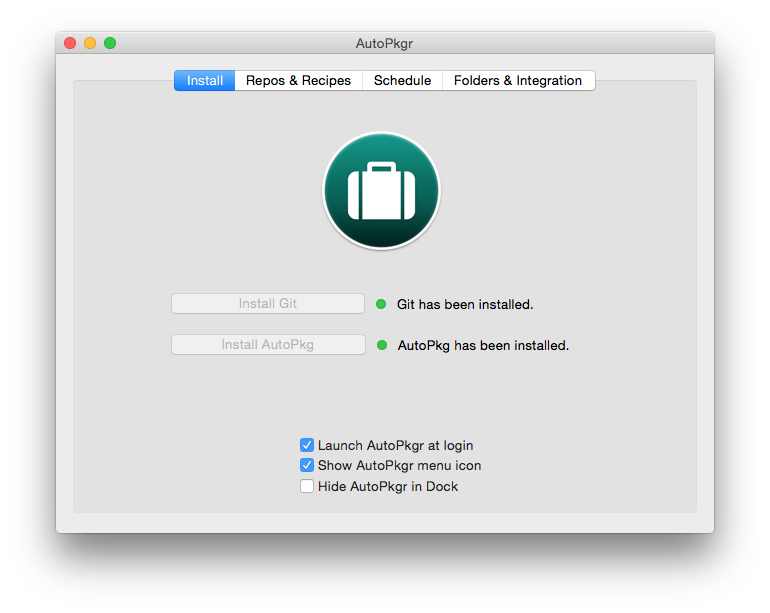
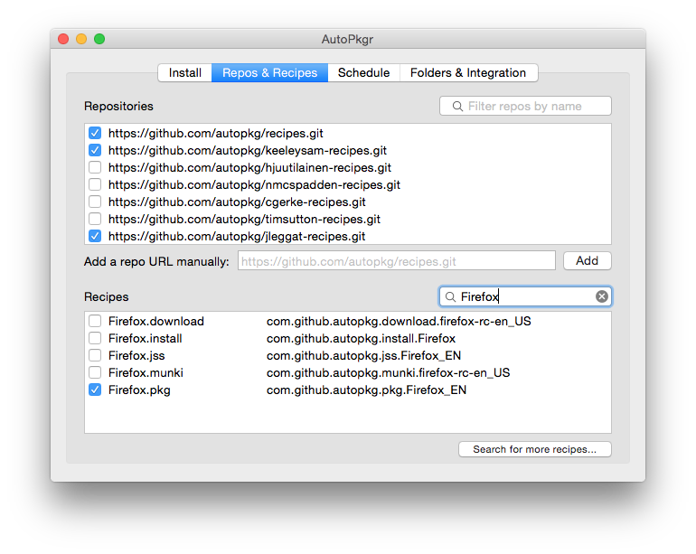
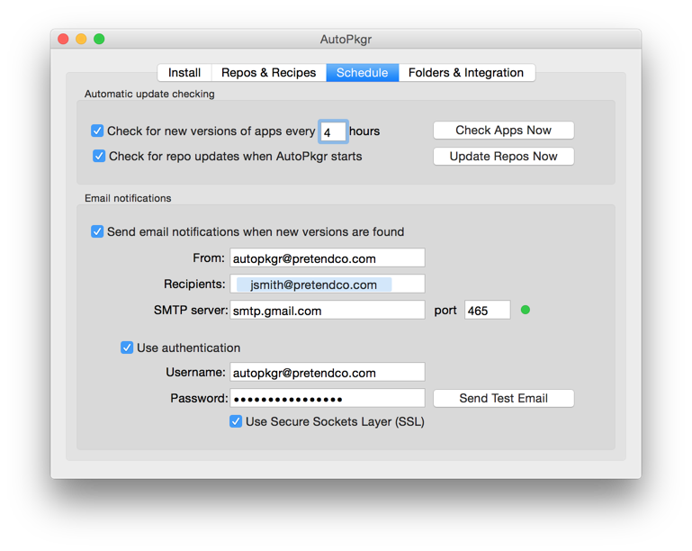
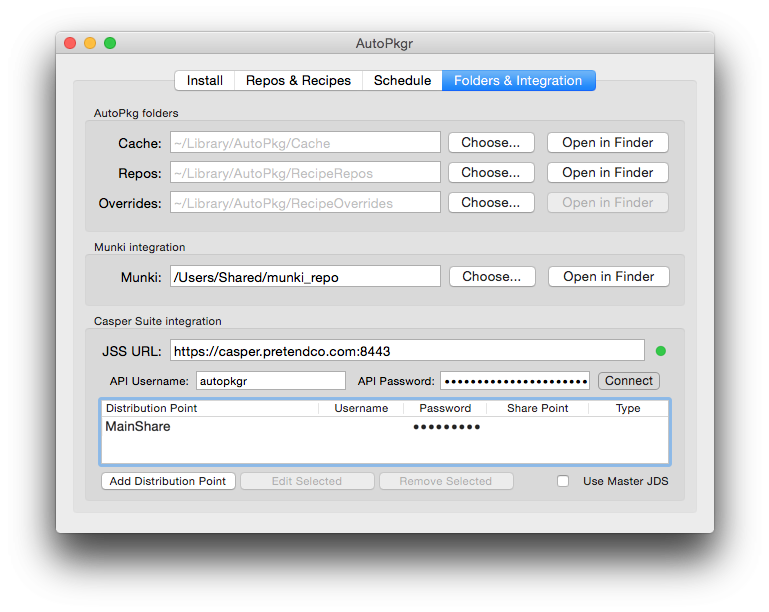

AutoPkgr
=======

Latest release is [here](https://github.com/lindegroup/autopkgr/releases/latest).

AutoPkgr is an app that makes it easy to install and configure [AutoPkg](https://github.com/autopkg/autopkg).

AutoPkg is an awesomely powerful tool for automating OS X software packaging and distribution, but it requires its users to be comfortable with command-line tools and methods.

If you're not comfortable with the command-line, or if you just want to get AutoPkg set up from scratch quickly, AutoPkgr is for you.

Features
--------

Here are the tasks that AutoPkgr makes easier:

* Installation of AutoPkg itself.
* Installation of Git, which AutoPkg requires.
* Discovery of and subscription to popular AutoPkg recipe repositories.
* Configuration of AutoPkg to use a local [Munki](https://code.google.com/p/munki/) repo.

AutoPkgr also lets you do all of the following, which wouldn't be possible using AutoPkg alone:

* Easy tracking of which specific AutoPkg recipes you care about.
* Automatic scheduled checks of the selected recipes.
* Email notifications when the recipes are updated (and sweet silence when they're not).
* One-click access to common folders that Munki and AutoPkg admins need.

Installation
------------

AutoPkgr requires Mac OS X 10.8 or higher.

Download the [latest release](https://github.com/lindegroup/autopkgr/releases/latest), and drag the AutoPkgr app to your Applications folder. Then launch it.

Usage
-----

1.  Launch the AutoPkgr app.

1.  On first launch, you'll be prompted to install Git (via Xcode command line tools) if you don't already have it.
    

1.  Then click the button to **Install AutoPkg** if needed.
    

1.  Switch to the **Repos & Recipes** tab.
    

1.  Select the repositories you'd like to subscribe to. We recommend the first one, to get you started. You can also add repositories manually by pasting their URL into the text field and clicking Add.

1.  Select the recipes you'd like to watch for changes.

1.  If you're importing the apps into a Munki repo, put the repo path in the **Local Munki Repo** box.

1.  Switch to the **Schedule** tab.
    

1.  Set your automatic update checking preferences — we recommend checking at least once per day, and checking for repo updates when AutoPkgr starts.

1.  Configure email notifications, if desired.

1.  Click **Save and Close**.

That's it! AutoPkgr will now check for the latest app updates you specified, and when an update is available you'll receive an email notification.

Anytime you'd like to make changes to AutoPkgr's configuration, just click on the AutoPkgr icon in the menu bar (), and choose **Configure...**

You'll also find some useful shortcuts on the **Local Folders** tab, which will take you directly to several convenient AutoPkg folders. On that tab, you can also configure the location of your local Munki repo, if you use Munki.
    

Credits
-------

AutoPkgr was created by James Barclay, Elliot Jordan, and Josh Senick of the [Linde Group](http://www.lindegroup.com) with help from Eldon Ahrold.

We're very friendly. Stop by Berkeley sometime and have an espresso.

Briefcase icon from [FontAwesome](http://fontawesome.io/).
