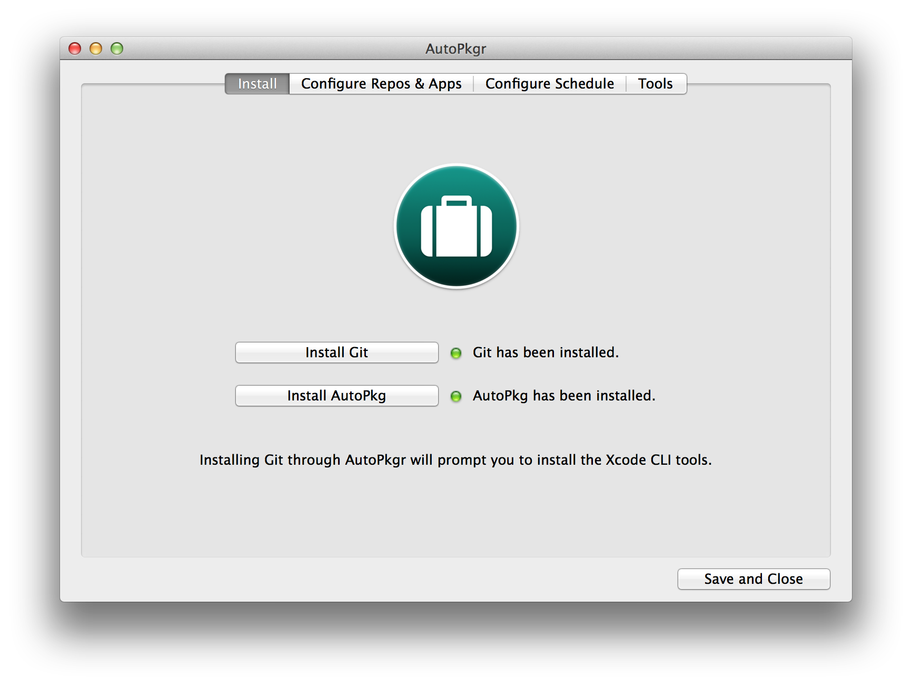

AutoPkgr
=======

Latest release is [here](https://github.com/lindegroup/autopkgr/releases/latest).

AutoPkgr is a background app that makes it easy to install and configure [AutoPkg](https://github.com/autopkg/autopkg).

AutoPkg is an awesomely powerful tool for automating OS X software packaging and distribution, but it requires its users to be comfortable with command-line tools and methods. We made AutoPkgr for people who are 1) uncomfortable with Terminal, but still eager to use AutoPkg to automate software packaging, or 2) comfortable with Terminal and manual administration of AutoPkg, but seeking a turnkey solution for quick deployment and configuration of AutoPkg.

Here are the tasks that AutoPkgr makes easier:

* Installation of AutoPkg itself.
* Installation of Git, which AutoPkg requires.
* Discovery and subscription to popular AutoPkg recipe repositories.
* Configuration of AutoPkg with a local [Munki](https://code.google.com/p/munki/) repo.

AutoPkgr also lets you do all of the following, which wouldn't be possible using AutoPkg alone:

* Easy tracking of which specific AutoPkg recipes you care about.
* Automatic scheduled checks of the selected recipes.
* Email notifications when the recipes are updated (and sweet silence when they're not).
* One-click access to common folders that Munki and AutoPkg admins need.

Installation
------------

Download the [latest release](https://github.com/lindegroup/autopkgr/releases/latest), and drag the AutoPkgr app to your Applications folder. Then launch it.

Usage
-----

1.  Launch the AutoPkgr app.
1.  On first launch, you'll see the configuration window:
    
1.  Click the button to **Install Git** if needed.
1.  Click the button to **Install AutoPkg** if needed.
1.  Switch to the **Configure Repos & Apps** tab and select the repositories you'd like to subscribe to. We recommend the first one, to get you started.
1.  Select the apps you'd like to watch.
1.  If you're piping the apps into a Munki repo, put the repo path in the **Local Munki Repo** box.
1.  Switch to the **Configure Schedule** tab. Set your automatic update checking preferences — we recommend checking at least once per day, and checking for repo updates automatically.
1.  Configure email notifications, if desired.
1.  Click Save and Close.

That's it! AutoPkgr will now check for the latest app updates you specified, and when an update is available you'll receive an email notification.

Anytime you'd like to make changes to AutoPkgr's configuration, just click on the AutoPkgr icon in the menu bar (it looks like an awesome little suitcase), and choose **Configure...**

Credits
-------

AutoPkgr was created by James Barclay, Elliot Jordan, Josh Senick of the [Linde Group](http://www.lindegroup.com)
